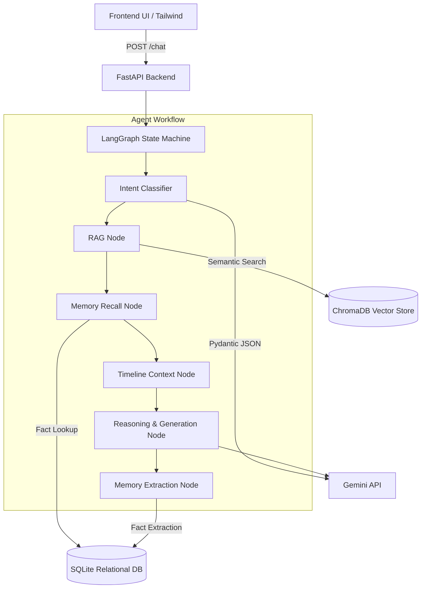

# Vikram Sarabhai Digital Twin: Tech Stack & Architecture

This document outlines the complete technology stack and codebase architecture used to power the autonomous digital twin.

---

## 🛠️ Technology Stack

### Frontend (Client-Side)
- **HTML5 & Vanilla JS (ES6)**: A lightweight, dependency-free Single Page Application (SPA).
- **Tailwind CSS**: Utility-first CSS framework loaded via CDN for rapid, responsive UI styling and dark/light modes.
- **Google Fonts**: Utilizes the modern `Inter` typeface.
- **Material Symbols**: Scalable iconography for UI elements.

### Backend (Server-Side)
- **FastAPI**: High-performance Python web framework to build asynchronous REST APIs and serve the frontend statically.
- **Uvicorn**: Lightning-fast ASGI web server implementation used to run the FastAPI app.

### AI & Agentic Core
- **LangGraph**: State machine orchestration library used to build the cyclical, multi-node agent workflow (Intent → RAG → Memory → Timeline → Reasoning → Output).
- **Google Gemini API (`gemini-2.5-flash`)**: The core Large Language Model used for reasoning, intent classification, and persona generation.
- **LangChain (`langchain-google-genai`)**: Abstraction layer integrating Gemini into the LangGraph workflow.
- **Pydantic**: Used heavily for rigid, structured schema validation (e.g., forcing Gemini to output strict JSON for Intent Classification and Fact Extraction).

### Data & Memory Layers
- **ChromaDB**: An open-source vector database used for Retrieval-Augmented Generation (RAG). It stores embedded chunks of Sarabhai's speeches and papers.
- **SQLite3**: A lightweight, serverless relational database used for the Long-Term Memory (LTM) system, storing extracted user facts and conversation summaries locally on disk.
- **Gemini Embeddings (`gemini-embedding-2`)**: Generates vector representations of textual data for semantic search within ChromaDB.

### System Utilities
- **Loguru**: Modern Python logging library for beautiful, structured console outputs.
- **Tenacity / Custom KeyRotator**: Retry handling and a thread-safe multi-key round-robin rotation script that mitigates `429 RESOURCE_EXHAUSTED` API rate limits on the free tier.

---

## 📂 Codebase Architecture

The project is structured modularly, separating concerns between AI orchestration, memory management, and data retrieval.

### Directory Breakdown

#### `/frontend`
Contains the static files served directly by FastAPI.
- **`static/index.html`**: The unified layout containing the Chat and Memory & Insights views.
- **`static/js/app.js`**: Client-side logic for DOM manipulation, managing conversation IDs, handling streaming UI updates, and sending network requests to the backend.

#### `/backend`
- **`main.py`**: The FastAPI server. It mounts the frontend directory, handles CORS, and exposes the vital `/chat` endpoint which invokes the LangGraph agent asynchronously.

#### `/agent`
The brain of the operation powered by **LangGraph**.
- **`agent_graph.py`**: Defines the `StateGraph` linking all the cognitive nodes together in a directed workflow.
- **`intent_classifier.py`**: Determines if the user is asking a factual query, discussing philosophy, planning a mission, or asking about a specific timeline, dynamically altering the agent's behavior.
- **`state.py`**: The TypedDict definition of the `AgentState` that flows through every node.
- **`/modes/`**: Specific structured output handlers (e.g., `mission_planner.py`, `research_mentor.py`) that trigger based on the intent.

#### `/rag` (Retrieval-Augmented Generation)
Handles domain knowledge lookup so the LLM doesn't hallucinate facts.
- **`retriever.py`** & **`vector_store.py`**: Interfaces with ChromaDB.
- **`embedder.py`**: Generates embeddings using Gemini.
- **`chunker.py` / `document_loader.py`**: Scripts to process raw corpus data into vector embeddings.

#### `/memory`
The long-term persistence layer allowing the agent to "remember" users across sessions.
- **`memory_extractor.py`**: Uses Gemini with strict JSON schemas to quietly extract facts, goals, and interests from the user's chat messages.
- **`memory_db.py`**: Interfaces with `memory.db` (SQLite) to save and retrieve those extracted facts.

#### `/persona`
Maintains the authenticity of Vikram Sarabhai.
- **`persona_engine.py`**: Synthesizes RAG context, long-term memory, and the base system prompt into the final query sent to the LLM.
- **`timeline_handler.py`**: Specifically isolates Sarabhai's knowledge to the appropriate era to prevent him from acknowledging modern tech if asked about the 1960s.

#### `/utils`
- **`api_rotator.py`**: A custom thread-safe singleton that intercepts network calls to the Gemini API. If the free tier exhausts its quota, it automatically catches the exception, shifts to the next available API key from `.env`, and retries the request seamlessly.

#### `/scripts`
- **`run_system.py`**: The main bootloader that validates the environment and spins up the FastAPI server via Uvicorn.
- **`validate_system.py`**: A pre-flight checklist to ensure databases, `.env` vars, and directories exist.
